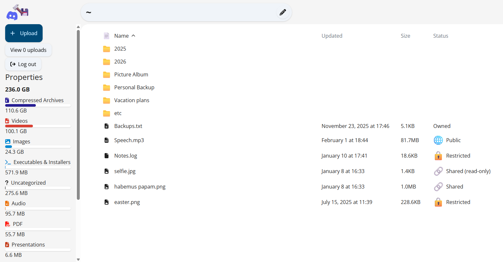

# discord-cloud (WIP)

An application for uploading, managing and downloading an infinite amount of files, with Discord as an invisible and encrypted cloud storage.



## Structure

This repository features one central unit, known as the manager. It is the only system with a connection to the database and communicates with clients and services. To allow for greater flexibility and faster uploads, services exist. These also communicate with the manager in a WebSocket. The terms manager and server may be used interchangeably.

The `UploadService` is meant to distribute the file uploading to multiple different instances and thereby enable concurrency. Each service is only assigned one file at a time. For the process of uploading, see `UPLOADS.md`.

The `ThumbnailService` handles the generation of small preview images for images and videos and only communicates with the manager. The generated images are stored in Supabase storage (or other storage providers in the future) for fast retrieval.

The storage in Discord is handled with a bot. Sending the messages could be implemented with webhooks, but as attachments links are now signed and expire, we cannot just store the message id, but have to retrieve the message from Discord's API to obtain a signed link. This requires us to have a token.

To store metadata about the files and folders, as well as users, this project uses Supabase. A schema for the database is included within `/manager/database`.

## Quick setup

For setting this up, you do not need to host the frontend yourself. A live build is running on https://discord-cloud.vercel.app, which allows you to enter any server address to communicate with.

For working with Discord, a bot needs to be set up and added to any Discord server. Whichever channel is specified within the upload service, the bot needs to have the `SEND_MESSAGES` and `READ_MESSAGES` permission for the channel to later retrieve the data. Messages are never deleted, even if the file is deleted.

It is recommended to have multiple upload services running to allow for concurrency. No thumbnail service needs to be running, but one is recommended if you have Supabase storage set up.

### Environment variables

Configuration for the manager and the services is housed mostly within environment variables (for now). Environment variables are divided into subsets, with subsets being used by different services. Subsets may also be optional. They are defined in `/common/environment.ts`.

<details>
    <summary>manager</summary>

    Used by: manager
    Required: yes

    A collection of all required environment variables for the manager.

    SERVICE_PASSWORD: Any string that acts as a password for all services to authenticate with the manager. The same string needs to be provided to all services
    SUPABASE_URL: The HTTP base url of the data API of the Supabase instance
    SUPABASE_KEY: A key as a raw string to supply to the Supabase API
    MANAGER_PORT: The port number under which to start the application
    PRIVATE_KEY: A base64-encoded PEM file, used to generate JWTs for user authentication
    PUBLIC_KEY: A base64-encoded PEM file

</details>

<details>
    <summary>crypto</summary>

    Used by: manager
    Required: no

    MESSAGE_ENCRYPTION_KEY: A base64-encoded raw buffer of 32 bytes. Used as the encryption key for message attachments. If not supplied, encryption needs to be disabled, otherwise an error will be thrown. Once this has been set and a file has been encrypted with it, it should not be changed. Is distributed to all services which need it upon their connection.

</details>

<details>
    <summary>upload-service</summary>

    Used by: upload-service
    Required: yes

    OWN_ADDRESS: A HTTP url under which clients can connect to this service
    PORT: The HTTP port under which to be open to clients, should be the same port as in OWN_ADDRESS unless you have some port forwardings like with hosting providers.

</details>

<details>
    <summary>service</summary>

    Used by: upload-service, thumbnail-service
    Required: yes

    A collection of all required variables for services to communicate with the manager.

    SERVICE_PASSWORD: The string specified by the manager
    MANAGER_ADDRESS: The socket url with which this service can connect to the manager (ws:// or wss://)

</details>

<details>
    <summary>logging</summary>

    Used by: manager, upload-service, thumbnail-service
    Required: no

    DEBUG_LOGGING: If not set to "1" or not specified, calls to logDebug() are ignored.
    OVERWRITE_LOGGING_FUNCTIONS: If set to "1", the default methods of the console object, such as console.log are overwritten with the functions of the logger.

</details>

Whenever environment variables are attempted to be read, but cannot be found, an error is thrown containing a list of all the missing environment variables.

### Supabase setup

As `discord-cloud` utilizes Supabase as the preferred database provider, you can either use a free/paid option on supabase.com or [host it yourself](https://supabase.com/docs/guides/self-hosting) using Docker. The free option Supabase provides allows for 500MB for your database and 1GB for thumbnail storage, which both should be more than enough for most setups.

The SQL statements needed to create all the tables and views can be found in `database.sql`. There is no further setup needed, as users and permissions are not handled by Supabase itself.

## Users and authentication

Each manager can have multiple users, each with their own username and password. Every user can see every file, but can only access their own files, those which are marked `public` or which are shared with them. All this means that you can set up one server and share it with multiple people.

You may mark your own files as `public` or `restricted`, meaning only you can access it. You can also share individual files you own with other registered users or transfer ownership to them.

### Register new users

For now, users can only be registered using the `/register` GET endpoint. This requires a `username` and a ` password` field and a JWT in the `token` field of a user marked as an `administrator`. Should there not be any user yet, the first user creation does not require the `token` field, and that user will be marked as an administrator. If this succeedes, a user can log in using the frontend or the `/login` GET endpoint wit the `username` and `password` fields. This will return a `token` field on success, containing a JWT signed for this user.

### Updating users

Using the `/update-password` endpoint, a user can change their password. This will cause all their active connections to be killed and all old JWTs to be invalidated.

### Signed downloads

To share files with people who do not have an account, a "signed download" can be generated in the frontend for one file. This copies a link to the clipboard that can download this specific file just by opening the link. The link is valid until the hash of the file changes or the file is deleted.

## Downloads

Downloads are performed over the manager directly. The `/download` and `/signed-download` routes both support the HTTP `Range` header fully.

A whole folder can also be downloaded using the `/bulk-download` route with the `path` parameter. This will stream a zip file to the client with all files within the folder and all subfolders. All files which the requesting user cannot read are simply skipped.

There is no disk overhead with downloads. In every case, every chunk is downloaded individually from Discord, decrypted and written to the TCP stream. Only once the client has drained the stream is the next chunk sent. If the client is too slow (very very slow), eventually the server will kill the connection. This also applies to `/bulk-download`, with the zip being streamed. Because of this, there is no support for the `Range` header on it.

## Communication

Communication is handled primarly via WebSocket connections to the manager. This system is built on a custom JSON protocol for packets. Some actions that can only be performed whilst the socket is not yet open are handled via HTTP routes, like `/login` and `/register`.

### Packet structure

Details are available in `PACKETS.md`.

```json
{
    "id": "namespace:packet-id",
    "uuid": "id of this packet for identification",
    "reply_uuid": "optional, specifies the uuid of the packet this is replying to",
    "data": {
        // a record of pre-defined data
    }
}
```

## Planned features

- Folder merging
- Actions (move, rename, delete) on the client
- marking uploads as private/public on the client
- creating folders on the client
- (limited) WebDAV support
- user management for administrators
- more `DataErrorField` instead of `null` returns in the backend
- client authentication store rework
- better client error handling
- connection view in client
- saving uploads on disconnect and retry buttons
- choosing the amount of desired upload services

## Disclaimer

This is a work in progress and very much a project built out of fun. The frontend is still very much unpolished, but all in all, it works.

Although I could not find anything in the [Discord Terms of Service](https://discord.com/terms), the [Community Guidelines](https://discord.com/guidelines), the [Developer Policy](https://support-dev.discord.com/hc/en-us/articles/8563934450327-Discord-Developer-Policy), nor the [Developer Terms of Service](https://support-dev.discord.com/hc/en-us/articles/8562894815383-Discord-Developer-Terms-of-Service) that this usage of Discord is explicitly against all these terms, you may only use this on your own risk. You are fully responsible for any damages incurred. This application comes with ABSOLUTELY NO WARRANTY, to the extent permitted by applicable law.

Enjoy 🎉
